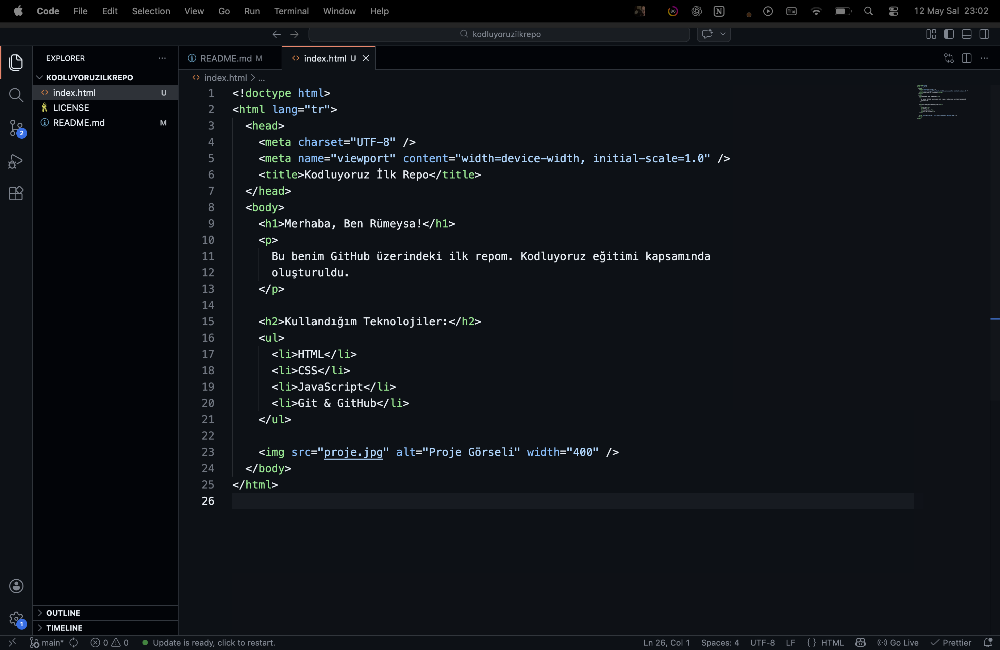

# kodluyoruzilkrepo

Kodluyoruz Eğitimi kapsamında açtığım ilk repo

Kodluyoruz Eğitimi kapsamında açtığım ilk repo. Bu repo içerisinde temel HTML yapısını ve GIT komutlarını pratik ediyorum.

## Proje İçeriği

Bu proje, bir `index.html` dosyası ve projenin ekran görüntüsünü içeren bir görselden oluşmaktadır.

## Proje Görseli

## Kurulum

Projeyi yerel bilgisayarınıza klonlamak için:
`git clone https://github.com/kullanici-adin/kodluyoruzilkrepo.git`

## Lisans

Bu proje [MIT License](LICENSE) ile lisanslanmıştır.
